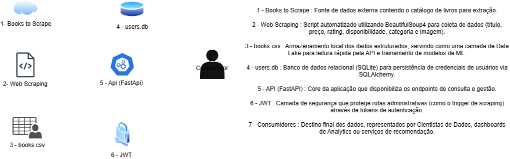
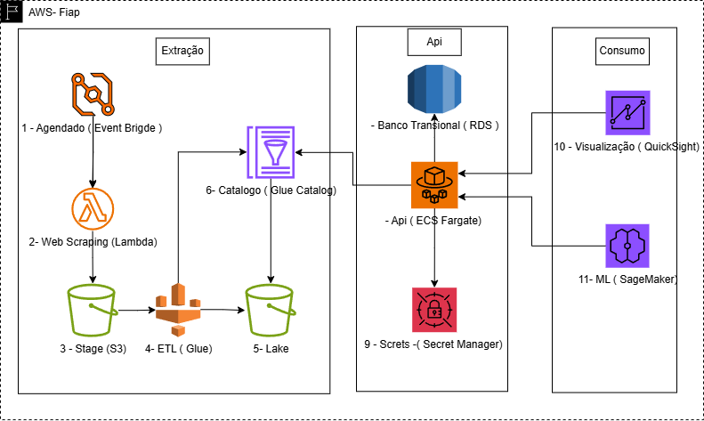

# Tech Challenge - Fase 1: Machine Learning Engineering

## Descrição do Projeto
Este projeto é o Tech Challenge da Fase 1 da Pós-Tech (FIAP). O objetivo é criar um pipeline de dados completo: Web Scraping, armazenamento em CSV e uma API para consulta.

> **Link para a API em Produção:** [https://fiap-tech-challenge-fase1.vercel.app/docs](https://fiap-tech-challenge-fase1.vercel.app/docs)
> 
## 🎥 Vídeo de Apresentação
        - **Link do Vídeo:** loom.com/share/3fcf728038be4acabed35343b87c9f03
        - **Conteúdo:** Demonstração da arquitetura, pipeline de dados e chamadas reais à API em produção 

---

## Plano Arquitetural e Fluxo de Dados


O diagrama acima descreve o pipeline de dados, estruturado para suportar futuras implementações de Machine Learning:

1. **Books to Scrape [1]**: Fonte de dados externa contendo o catálogo de livros.
2. **Web Scraping [2]**: Script automatizado utilizando BeautifulSoup4 para coleta e extração de dados.
3. **books.csv [3]**: Armazenamento local dos dados estruturados (Título, Preço, Rating, Categoria, etc).
4. **users.db [4]**: Banco de dados relacional (SQLite) para persistência de credenciais e usuários.
5. **API (FastAPI) [5]**: Core da aplicação que processa as requisições e serve os dados.
6. **JWT [6]**: Camada de segurança (JSON Web Token) para proteção de rotas administrativas.
7. **Consumidores [7]**: Destino final dos dados para Cientistas de Dados ou modelos de recomendação.

## Plano Arquitetural Para AWS


---

## Como Executar
### 1. Criar Ambiente Virtual

Windows:
```bash
python -m venv venv
.\\venv\\Scripts\\activate
```

Linux/Mac:
```bash
python3 -m venv venv
source venv/bin/activate
```

### 2. Instalar Bibliotecas
```bash
pip install -r requirements.txt
```

### 3. Rodar o Scraper
```bash
python scripts/scraper.py
```

### 4. Rodar a API
```bash
uvicorn api.main:app --reload
```

---

## Documentação da API

### 1. Health Check
- **Rota:** `GET /api/v1/health`
- **Descrição:** Verifica se a API está online.
```json
// Response
{"status": "ok", "message": "Service is healthy"}
```

### 2. Listar Livros
- **Rota:** `GET /api/v1/books`
- **Descrição:** Retorna a lista completa de livros extraídos.
```json
// Response Example
[
  {
    "id": 1,
    "title": "A Light in the Attic",
    "price": 51.77,
    "rating": 3,
    "category": "Poetry"
  }
]
```

### 3. Detalhes do Livro
- **Rota:** `GET /api/v1/books/{id}`
- **Descrição:** Busca um livro específico pelo seu identificador único.
```json
// Request: GET /api/v1/books/1
{
  "id": 1,
  "title": "A Light in the Attic",
  "price": 51.77,
  "image_url": "..." 
}
```

### 4. Listar Categorias
- **Rota:** `GET /api/v1/categories`
- **Descrição:** Lista dinamicamente todas as categorias encontradas na base.
```json
// Response
["Poetry", "Fiction", "History", "Classics"]
```

### 5. Registro de Usuário
- **Rota:** `POST /api/v1/auth/register`
- **Descrição:** Cria um novo usuário para acessar rotas protegidas.
```json
// Request Body
{
  "username": "seu_usuario",
  "password": "sua_senha"
}
```

### 6. Login (Obter Token)
- **Rota:** `POST /api/v1/auth/login`
- **Descrição:** Autentica o usuário e retorna um Token JWT.
```json
// Response
{
  "access_token": "eyJhbGciOiJIUzI1NiIsInR5cCI...",
  "token_type": "bearer"
}
```

### 7. Disparar Web Scraping (Protegido)
- **Rota:** `POST /api/v1/scraping/trigger`
- **Descrição:** Inicia o processo de raspagem de dados do site Books to Scrape. Requer autenticação JWT.
- **Header:** `Authorization: Bearer <seu_token>`
```json
// Response (200 OK)
{
  "message": "Scraping iniciado com sucesso",
  "status": "running"
}
```

### 8. Busca por ID (Detalhada)
- **Rota:** `GET /api/v1/books/{id}`
- **Descrição:** Retorna todos os detalhes de um livro específico.
```json
// Exemplo: GET /api/v1/books/10
{
  "id": 10,
  "title": "Starving Hearts",
  "price": 42.77,
  "rating": 2,
  "availability": "In stock",
  "category": "Default",
  "image_url": "[http://books.toscrape.com/media/](http://books.toscrape.com/media/)..."
}
```

---


*Projeto obrigatório - FIAP Pós-Tech Fase 1*
